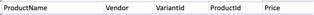

This project is to make things easier when updating prices in Shopify.

My client had a shop and they always got their pricing of their seasonal product in excel docs.
Instead of manually updating each price every season I figured it'd be easier to have it scripted.

# Prerequisites
### Google Sheets
This requires a Google Sheet with the following format:

ProductId, and Vendor aren't required but I have them there for more
clear logging.. You can do whatever you want as long as you take it into
account as you process the sheet.

In order to find all your ProductName, Vendor, VariantId, ProductId, and
Price, you can do a GET on your products endpoint. You probably also
want to filter which fields are returned so your response isn't massive.
This is what mine looked like:
`https://{{APIKEY}}@{{BASEURL}}/admin/api/2020-04/products.json?fields=title%2Cvendor%2Cvariants
`

Once you've created your sheet go to **File>Publish to the web** then
publish the sheet you want to publish as a csv.

Put that link in a file called Properties.py as sheetsURL = "Yourlink"

### Shopify API
This tool bulk updates products using the variant API.

You'll need to configure your API in Shopify. Follow the [Make your first
Shopify API request](https://shopify.dev/tutorials/make-your-first-shopify-api-request) documentation.

Once you've set up your API for your store, the following to your
Properties.py.
* shopifyURL =
  "https://yourAPIKey@yourStoreURL/admin/api/2020-04/variants/"
* headers = {'X-Shopify-Access-Token': 'yourAPISecret',
  'Content-type':'application/json'}

# Run in debug mode first!
Make sure you debug this before running it on a large dataset so you're
sure you don't mess up your pricing. Good luck!
